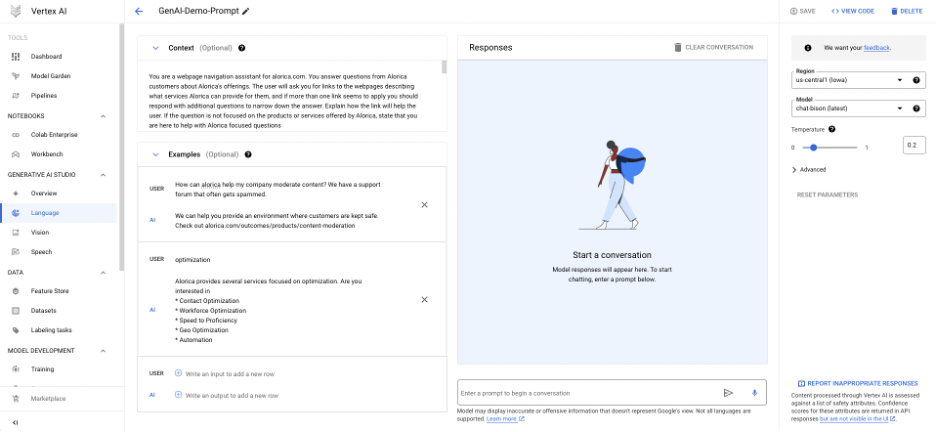
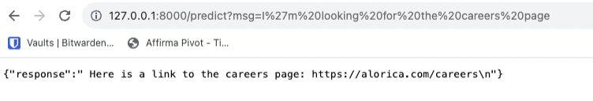
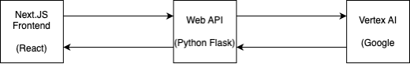
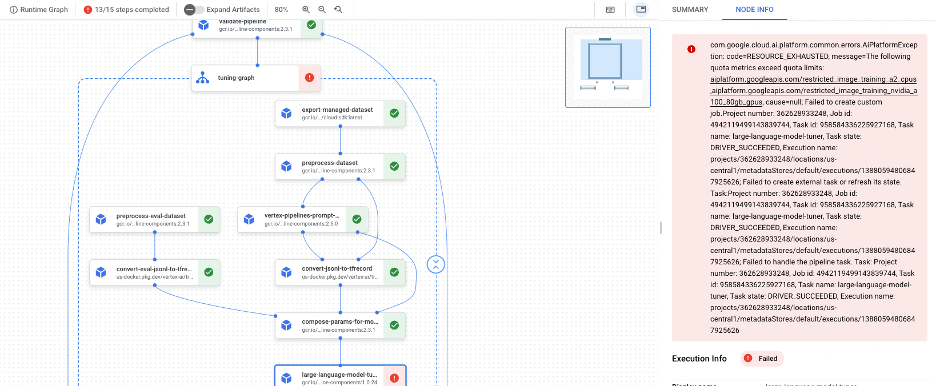

# Building the demo
While I was building the demo I took the chance to experiment with various Vertex AI technologies and attempted to perform tuning on the prebuilt models provided by Vertex.
The path that showed the most promise and evolved into the demo was the ability to provide custom prompts to call the chat-bison model and receive responses. 
Vertex AI provides a capability to create and evaluate prompts within the web UI. 
After I used a python script to extract abbreviated links from the sitemap file, I was able to construct a prompt including the sitemap and other instructions, along with example inputs and outputs.

Based on the documentation I was able to produce a python script to call the chat-bison model locally using the Python API for Vertex AI, and I then built a small Flask server to receive HTTP requests, operate the python script, and send back the responses from the chat-bison model.
A picture of the flask server running locally:

After this was built, I created a react frontend using Next.JS to communicate with the flask server and display the responses in a chat-focused UI.
This is the subject of the recorded demo, which is included as another attachment:

# Structure of the Demo

The demonstration site is made up of 3 components:
- GCP Vertex AI, which provides the inference for user chat sessions. Chat inference is based on the chat-bison model. 
- A Python Flask web server API to interface with GCP Vertex. The files for this web API are located in the /webapi/ directory. When a GET request is sent to the /predict endpoint with a msg parameter, the server extracts that sent message and sends it to Vertex AI to get a chat response. That response is then decoded, parsed, and returned to the requestor.
- A Next.JS react frontend, demonstrating the chat window over an image of the Alorica homepage. The files for this demo are located in the /alorica-chatbot-demo/ directory. You can type messages into the chat window and send them, and then receive responses as soon as the AI has constructed them. 

# Other Experiments
I investigated DialogFlow but learned from the documentation that it offered very limited customization options to use a LLM for chat support.
Instead, DialogFlow expects the user to build a series of Intents or Flows to handle conversational practices.
While these intents and flows can be useful for building chatbots that can receive parameters from the user, the limited flexibility means that functionality to support customer inquiries would have to be built explicitly.   
 
Before building the chat-bison demo, I experimented with the other capabilities of Vertex AI, and attempted to build datasets for tuning an AI model with sample data for this specific use case.
While I was able to build datasets, when it came time to perform tuning I was blocked by the need to request quota increases for all of the hardware that is required to tune an AI model in GCP.
Since these requests are serviced by humans the turnaround time was too short to experiment further with.
However, here is what I learned about tuning a chat model and tuning a vector embedding model:
 
- Tuning the chat-bison model can be done by providing extra examples of user chats and responses. I used this knowledge to construct a sample tuning dataset, which can be found in the file /scripts/chat_bison_tuning_dataset.jsonl
- Tuning the text-embedding model can be done by providing a corpus of extra documents, a corpus of queries about those documents, and a set of training data for the model. 
  - I wrote a script to scrape the text content of Alorica’s web pages listed in the sitemap and convert the text into documents for the corpus. The corpus can be found in scripts/embeddings_dataset_corpus.jsonl
  - The queries file contains labeled queries that can be matched to documents. It was constructed from another script that displayed a document and then collected the user’s input for a query that could match the document. The queries I created can be found in scripts/partial labeled data runs/, along with the train and test files. The train and test files are TSV files that map queries to corpus documents that match them.
 
Here's a picture of my attempt to run a tuning pipeline on GCP, which could not be completed due to the quota requirement mentioned previously.

# Other Artifacts
I included in the zip package all of the other artifacts used to experiment with Vertex AI capabilities, including the files for the experiments that were blocked by GCP quota requirements. 
 
These are a collection of python scripts that are contained in the scripts/ directory.
- generate_list_of_links.py parses the Alorica sitemap provided and returns the links in the XML file as a newline-delimited string. It can also filter out some subdirectories of the root site. This file was used to help build the chat-bison prompt, and certain subdirectories (e.g. /news/) were filtered to fit the most pages into the prompt under token constraints.
- create_chat_bison_tuning_data.py is an interactive script that can save user prompts about a page to a JSONL file for use in tuning the chat-bison model in Vertex AI. It creates a series of prompt + request + response items that provide the chat-bison model with additional examples for Alorica specific items. It writes its output to a file called <prefix>_tuning_dataset.jsonl, with <prefix> specified by the user to enable multiple runs without overwriting previous sessions.
- generate_embedding_training_set.py is a script that scrapes the text content of the Alorica site and creates a text corpus for tuning a vector embedding model. The text corpus is one document per page, with each document containing the contents of that page. It writes the corpus to a file called embeddings_dataset_corpus.jsonl
- query_builder.py is an interactive script to build the query JSONL file needed for text embedding training. It shows a document from the corpus generated by generate_embedding_training_set.py and waits for the user to enter a query or prompt that might lead to the retrieval of that document. Data is saved to <prefix>_dataset_queries.jsonl, <prefix>_dataset_train.tsv, and <prefix>_dataset_test.tsv. These files can be uploaded to GCP storage for use in tuning the text-embedding model. 
